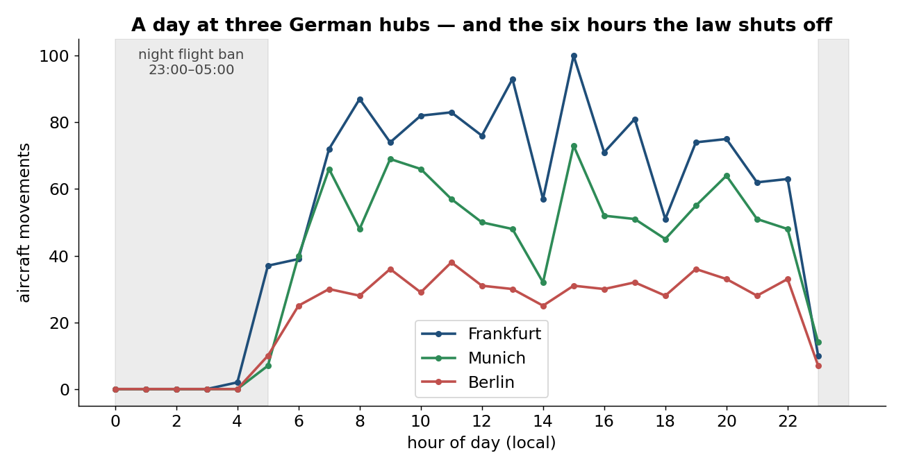
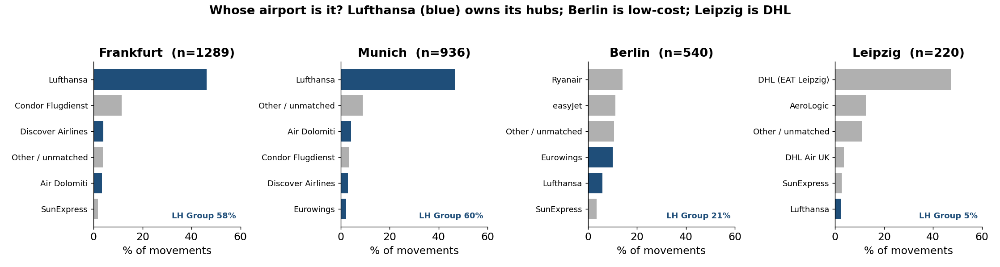
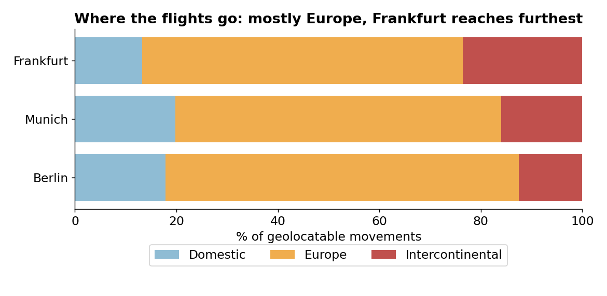

# ✈️ FlugZeug — Does Germany's Night Flight Ban Stop Night Flying?

Analysing one day of real air traffic at **Frankfurt (EDDF)**, **Munich (EDDM)**, **Berlin Brandenburg (EDDB)** and **Leipzig/Halle (EDDP)** — extracted from open ADS-B data — to answer one question:

> **Germany bans night flights at its big passenger hubs to protect residents from noise. Does that eliminate night aviation — or just relocate it?**

It relocates it. Frankfurt, Munich and Berlin go essentially dark from 23:00 to 05:00 by law. Leipzig/Halle — Germany's round-the-clock cargo hub and DHL's European base — does **43% of its daily traffic in that exact window**, because nothing stops it from doing so. The ban doesn't reduce night flying, it moves it to the one airport allowed to do it.

---

## Table of contents
- [Key findings](#key-findings)
- [Results](#results)
- [Data sources](#data-sources)
- [How it works](#how-it-works)
- [Repository structure](#repository-structure)
- [Running it yourself](#running-it-yourself)
- [The 3D flight-network map](#the-3d-flight-network-map)
- [Limitations](#limitations)
- [Possible extensions](#possible-extensions)
- [Tech stack](#tech-stack)
- [Data attribution & licensing](#data-attribution--licensing)

---

## Key findings

Based on **2,985 aircraft movements** across the four airports on **19 August 2026** (a normal weekday).

| Airport | Movements | Night share (23:00–05:00) | Top operator | Lufthansa Group |
|---|--:|--:|--:|--:|
| Frankfurt (EDDF) | 1,289 | 0.9% | Lufthansa (46%) | 58.0% |
| Munich (EDDM) | 936 | 1.5% | Lufthansa (47%) | 59.5% |
| Berlin (EDDB) | 540 | 1.3% | Ryanair (14%) | 21.5% |
| **Leipzig (EDDP)** | 220 | **43.2%** | **DHL / EAT Leipzig (47%)** | 5.0% |

1. **The night ban doesn't remove night flying — it concentrates it at Leipzig.** Frankfurt, Munich and Berlin fall to under 1.5% of their traffic in the banned window; Leipzig runs **43.2%** of its whole day inside it. Leipzig has no passenger-noise curfew, so it's where Germany's night-time air cargo physically lives. This is the reason DHL built its European hub there instead of at a bigger, more central passenger airport.
2. **Leipzig isn't a small version of the other three — it's a different business.** Its top "airline" is DHL's own EAT Leipzig operation (47% of movements), Lufthansa Group is nearly absent (5%), and its rhythm is inverted: quiet in the afternoon, busy overnight. Same country, same aviation law, completely different airport because the ban makes night operation a scarce resource that one place monopolises.
3. **Among the passenger hubs, Lufthansa dominates where it builds a hub and competes where it doesn't.** At Frankfurt and Munich the Lufthansa Group runs ~58–60% of movements; at point-to-point, low-cost Berlin it runs just 21%, led instead by Ryanair and easyJet. All three still share the same curfew — the ban is not what separates them.

**In one line:** *A noise law written to stop night flights doesn't stop them — it relocates them entirely onto the one German airport with no such restriction, and that airport is now effectively DHL's overnight hub.*

---

## Results

### Does the ban stop night flying, or just move it?
Frankfurt, Munich and Berlin collapse to near-zero overnight. Leipzig does the opposite — it's busiest exactly when the others are shut.



### Whose airport is it?
Lufthansa Group carriers (blue) dominate Frankfurt and Munich, barely register at Berlin (led by low-cost carriers), and are essentially absent from Leipzig — which is DHL's operation, not a passenger airline's.



### Where do the flights go?
All four are similarly Europe-heavy by destination count; the ban's effect shows up in *when* airports fly, not primarily *where* they fly.



> Note: the "Intercontinental" split above is continent-based and counts Turkey/North-Africa leisure routes, which flatters Berlin. Measured by true great-circle distance (>4,000 km), Berlin does almost no long-haul (2.0%) versus Frankfurt's 16.1%.

---

## Data sources

| Source | Used for | Notes |
|---|---|---|
| **[OpenSky Network](https://opensky-network.org/)** | Flight movements (departures + arrivals) | Free for non-commercial/research use. ADS-B tracking data — **no schedules, delays, or passenger/revenue figures.** OAuth2 client-credentials auth. |
| **[OurAirports](https://ourairports.com/)** | Airport → country, continent, coordinates | Public-domain reference data. |
| **[OpenFlights](https://openflights.org/data.html)** | Airline ICAO code → name | Community reference data (with hand corrections for a few stale/mislabelled entries, including DHL's Leipzig operators). |

---

## How it works

A two-stage pipeline:

**Stage 1 — Extraction (`fetch_flights.py`)**
Authenticates to OpenSky (OAuth2), pulls a full day of departures and arrivals for all four airports via the `/flights/departure` and `/flights/arrival` endpoints, and writes one tidy `flights_raw.csv`.

**Stage 2 — Enrichment & analysis (`enrich_analyze.py`)**
- Derives each movement's **hour** (local time), the **other endpoint** airport, and its **direction**.
- Joins **airline** from the callsign prefix (ICAO code → name), with explicit hand corrections and a stated **Lufthansa Group** definition (`DLH, CLH, EWG, GEC, DLA, OCN, BEL, SWR, AUA`) and DHL/cargo operator overrides for Leipzig (`BCS, BOX, DHK, ABR`).
- Joins the other airport's **country, continent, and coordinates**, then classifies **reach** (Domestic / Europe / Intercontinental) and computes **great-circle distance**.
- Produces the three charts, a `flights_enriched.csv`, and a `routes_for_kepler.csv` for the 3D map.

---

## Repository structure

```
.
├── fetch_flights.py          # Stage 1: pull raw movements from OpenSky
├── enrich_analyze.py         # Stage 2: clean, enrich, analyse, plot
├── credentials.json          # your OpenSky client_id/secret  (gitignored!)
├── airports.csv              # OurAirports reference (downloaded)
├── airlines.dat               # OpenFlights reference (downloaded)
├── flights_raw.csv           # output of Stage 1 (gitignored, regenerable)
├── flights_enriched.csv      # output of Stage 2
├── routes_for_kepler.csv     # arc data for the 3D map
├── chart1_rhythm.png         # hourly traffic + night ban (the centerpiece)
├── chart2_reach.png          # reach split
└── chart3_airlines.png       # airline concentration
```

---

## Running it yourself

### 1. Prerequisites
```bash
pip install requests pandas matplotlib tzdata
```
> Install into the **same Python** you run the scripts with (e.g. `python3.12 -m pip install ...`).

### 2. Get OpenSky credentials
Create a free [OpenSky account](https://opensky-network.org/), then create an **API client** to obtain a `client_id` and `client_secret`. Provide them either as environment variables (`OPENSKY_CLIENT_ID` / `OPENSKY_CLIENT_SECRET`) or in `credentials.json`:
```json
{ "client_id": "your_client_id", "client_secret": "your_client_secret" }
```
> ⚠️ `credentials.json` is already in `.gitignore`. Never commit secrets.

### 3. Download the reference data
```bash
curl -L -o airports.csv https://raw.githubusercontent.com/davidmegginson/ourairports-data/main/airports.csv
curl -L -o airlines.dat https://raw.githubusercontent.com/jpatokal/openflights/master/data/airlines.dat
```

### 4. Run the pipeline
```bash
python3 fetch_flights.py      # -> flights_raw.csv
python3 enrich_analyze.py     # -> enriched CSV, kepler CSV, 3 charts
```
> To analyse a different day, change the `DATE` variable in `fetch_flights.py` (use a normal weekday; avoid weekends and public holidays).

---

## The 3D flight-network map

Open [kepler.gl/demo](https://kepler.gl/demo), drag in `routes_for_kepler.csv`, and add an **Arc layer**:
- **Source:** `home_lat`, `home_lon`
- **Target:** `o_lat`, `o_lon`
- **Color by:** `reach`
- **Height / weight by:** `flights`

The result is all four airports throwing arcs across a 3D globe — Frankfurt's worldwide reach and Leipzig's dense, tight cargo network obvious side by side.

---

## Limitations

- **Coverage:** OpenSky is crowd-sourced from volunteer ground receivers, so a small share of flights can be missing, and a portion of movements had no confidently geolocatable other-airport. A few extreme distance values are estimation artefacts.
- **One day:** this is a single weekday snapshot, not a seasonal or annual average — Leipzig's night share in particular can vary with cargo demand.
- **No economics:** flight-movement data shows *what flies*, not revenue, prices, passengers, or profit. Any competitive-economics reading here is a **hypothesis to test with other data**, not a proven claim.
- **Airline labels:** derived from crowd-sourced references; a small "unmatched" bucket is left honestly unlabelled rather than guessed.

---

## Possible extensions

- Add **aircraft type** (OpenSky aircraft database, `icao24` → type) to confirm Leipzig's night movements are dominated by freighters, not passenger diversions.
- Extend to **multiple days** to see whether Leipzig's night share is stable or cargo-season-dependent.
- Add **Cologne/Bonn (EDDK)**, Germany's other major night-cargo airport, to see whether the relocation effect concentrates on Leipzig alone or splits across the airports still allowed to fly at night.
- Layer in a **single-flight 3D track** (FR24 KML → Google Earth) as a detail visual.

---

## Tech stack

**Python** · pandas · NumPy · Matplotlib · OpenSky REST API (OAuth2) · kepler.gl

---

## Data attribution & licensing

- Flight data © **The OpenSky Network** — used under its non-commercial/research terms. Please cite OpenSky if you reuse this.
- Airport data from **OurAirports** (public domain).
- Airline data from **OpenFlights** (Open Database License).

Project code is free to reuse for learning and non-commercial purposes. Reference datasets remain under their respective licenses.

---

*Built as an independent data project — extracting and analysing open aviation data from scratch.*
